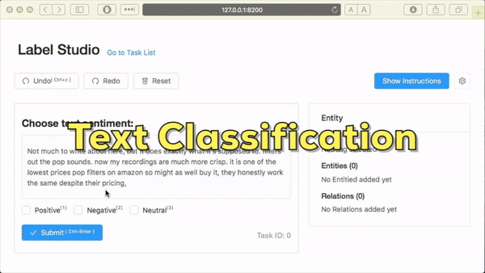

# Label Studio


 [](https://travis-ci.com/heartexlabs/label-studio)

Label Studio is an open-source, configurable data annotation tool. Its
purpose is to enable you to label different types of data using the
most convenient interface with the standardized output format.



## Quick "I want to Label Guides:"

- [Classify text for sentiment](/examples/sentiment_analysis/START.md) ([screenshot](./images/screenshots/cts.png))
- [Named entities recognition](/examples/named_entity/START.md) ([screenshot](./images/screenshots/ner.png))
- [Transcribe audio](/examples/transcribe_audio/START.md) ([screenshot](./images/screenshots/audio-trans.png))
- [Classify audio](/examples/audio_classification/START.md) ([screenshot](./images/screenshots/audio-classify.png))
- [Conversational modeling & chatbots](/examples/chatbot_analysis/START.md) ([screenshot](./images/screenshots/chatbots.png))
- [Image object detection](/examples/image_bbox/START.md) ([screenshot](./images/screenshots/image-object.png))

Coming Soon:
- Audio regions (screenshot)
- Image line and points (screenshot)
- Image polygons (screenshot)
- Time series (screenshot)
- Video (screenshot)

## Table of Contents

- [Introduction](#introduction)
  - [Run Locally](#run-locally)
  - [Extend & Embed](#extend--embed)
- [Features](#features)
- [Using Label Studio](#using-label-studio)
- [Format](#format)
  - [Input](#input)
  - [Output](#output)
- [Contributing](#contributing)
- [License](#license)

## Introduction

Label Studio consists of two parts. Backend is a simple flask server
that is used to load the data and save the results. The frontend is a
[React](https://reactjs.org/) +
[MST](https://github.com/mobxjs/mobx-state-tree) app that is backend
agnostic and can be used separately, for example if you want to embed
labeling into your applications.

### Run Locally

In order to launch server locally, launch
```bash
cd backend
bash start.sh
```

To run it locally we include the compiled version of the frontend
part and an example implementation of the backend.

[Follow this guide for advanced usage & custom configuration](backend/README.md)

### Extend & Embed

To extend the functionality or embed the labeling inside your app, you
need to be able to compile it from the sources. 

[This guide explains how to do that](docs/Embed.md)

## Features

- Extensive UI configuration options
- Multiple datatypes supported: images, text, audios
- Hotkeys & History
- Converting to formats accepted by popular machine learning apps ([check here](/backend/converter/README.md) for supported GitHub repositories)

## Using Label Studio

### Config Language 

Editor configuration is based on XML-like tags. Internally tags are
represented by a react view and mobx-state-tree model. Each config
should start with a <View></View> tag. Here is an example of a simple
text classification config:

```html
<View>
	<Text name="text"></Text>
	<Choices name="choice" toName="text">
		<Choice value="relevant"></Choice>
		<Choice value="non relevant"></Choice>
	</Choices>
</View>
```

Note that we use tag names to connect tags between each
other. Therefore tags that are used for labeling should include a name
attribute. And every tag has its own set of parameters. Find more info
in the related doc:

[Tags Documentation](/docs/Tags.md).

Creating your own tags is the suggested way to extend the app and
tailor it to your specific needs.

## Format 

### Input

Input should be JSON formatted. All the files that you want to label
are expected to be hosted somewhere and provided as an URL in the
JSON. The example backend server can process other formats, but it
converts any format into the JSON as a result.

### Output

Output is JSON. Overall strucutre is the following:

```json
{
	"completions": [
		{ 
			results: {
				"id": "yrSY-dipPI",
				"from_name": "sentiment",
				"to_name": "my_text",
				"type": "choices",
				"value": {
					"choices": [
						"Neutral"
					]
				}
			}
		}
	],
	"data": {
		JSON INPUT
	}
}
```

Completion is an object with five mandatory fields:

- **id** unique id of the labeled region
- **from_name** name of the tag that was used to label region
- **to_name** name of the tag that provided the region to be labeled
- **type** type of the labeling/tag
- **value** tag specific value that includes the labeling result details

For popular machine learning libraries there is converter code to
transform Label Studio format in ML library format. [Learn More](/backend/converter/README.md) 
about it.

## Contributing

- [Contributing Guideline](/CONTRIBUTING.md)
- [Code Of Conduct](/CODE_OF_CONDUCT.md)

## License

This software is licensed under the [Apache 2.0 LICENSE](/LICENSE) ©
[Heartex](https://www.heartex.net/).
